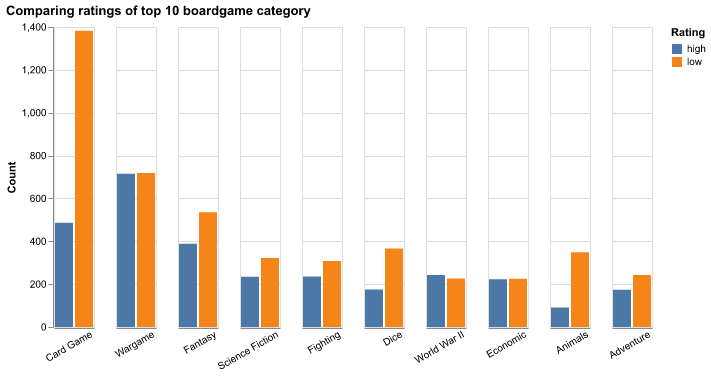

```{r setup, include=FALSE}
knitr::opts_chunk$set(echo = FALSE)
library(tidyverse)
library(knitr)
library(kableExtra)
```

# Summary

In this project we have built and evaluated a predictive regression model that can be used to predict board game user ratings for new board games. The final model performed moderately well on the unseen test data set, with an $R^2$ score of 0.480. Although promising, our board game rating predictor needs further analysis to be fine tuned and improved in its efficiency and accuracy.

# Introduction

According to a small [survey](https://boardgamegeek.com/thread/557292/average-how-long-do-you-take-develop-game) on [BoardGameGeek](https://boardgamegeek.com/), many board game developers report that it takes them several months to develop a board game, sometimes over a year [@survey]. As board game enthusiasts, we aim to answer the following question: Given certain characteristics about a new board game, can we use a machine learning model to predict how users would rate the board game? Answering this question will help board game creators understand which characteristics enhance user enjoyment and make better decisions as they develop the game, saving them time and improving the popularity of their new board game.

# Methods

## Data

We used a large data set containing user ratings and reviews for thousands of board games, created by [BoardGameGeek](https://boardgamegeek.com/) and made available by [tidytuesday](https://github.com/rfordatascience/tidytuesday), which can be found [here](https://github.com/rfordatascience/tidytuesday/tree/master/data/2022/2022-01-25) [@data]. The data consists of two data sets with each row representing a different board game. One data set contains the user ratings, and the other contains information about the board games, including names and descriptions, as well as several characteristics such as playing time, minimum age, number of  players, etc. We first prepossessed the data by joining the two data sets together, dropping unnecessary columns and columns with too many missing values, and splitting the data into 50% training set and 50% test set. Since the data set is sufficiently large, we also dropped rows with missing values to improve the speed of model training. The pre-processed data can be found [here](https://github.com/UBC-MDS/boardgame_rating_predictor/tree/main/data/processed). 

## Analysis

We used the random forest (RF) algorithm to build a regression model that predicts the average user rating based on various game features. The data used to fit the model was composed of the average user rating as the target, as well as a combination of numeric, categorical and textual variables as the predictors, including description, year published, minimum players, maximum players, playing time, minimum playtime, maximum playtime, minimum age, board game category, board game mechanic, board game family, board game designer, board game artist, and board game publisher. The RF hyperparameters `max_depth`, `max_features`, `bootstrap`, `min_samples_leaf`, and `min_samples_split` were optimized using 5-fold cross-validation in a randomized search with $R^2$ as the scoring metric. 

To perform this analysis and create this report, the Python and R programming languages [@Python; @R] were used, along with the following Python and R packages: docopt [@docopt], numpy [@numpy], pandas [@pandas], altair [@altair], scikit-learn [@learn], tidyverse [@tidy], and knitr [@knitr]. The code used to conduct this analysis and create this report can be found [here](https://github.com/UBC-MDS/boardgame_rating_predictor).

# Results & Discussion

To better understand the data, we conducted exploratory data analysis by plotting the distributions of the average rating target, the numeric features, as well as a few categorical features. Figure 1 below shows that the distribution of the average user ratings has a nearly symmetrical bell-shape and a slight left skew, with most user ratings falling between 6-7 on a 10 point scale. 

```{r rating-distribution, echo=FALSE, fig.cap="Figure 1. Distribution of average board game user ratings.", out.width='60%'}

```

With the exception of minimum age, the distributions of the numeric features appear to be heavily right skewed with most values falling towards lower values (Figure 2).

```{r numeric-distributions, echo=FALSE, fig.cap="Figure 2. Distributions of numeric predictors.", out.width = '100%'}
knitr::include_graphics("../results/numeric_feature_distribution.png")
```

To visualize the distributions of the categorical features, we augmented the training set and added a column that binarizes the average rating target column, with values larger than or equal to 7 being "high" and values less than 7 being "low". This allows us to observe which categories are found in board games that tend to be rated "high" versus "low", as shown in Figures 3 and 4 below. For example, we can see that many more card games are rated low than high, while war games have equal counts of high and low ratings.

```{r boardgame-categories, echo=FALSE, fig.cap="Figure 3. Number of board games rated high (7-10) versus low (1-6) for the 10 most common board game categories.", out.width = '75%'}

```

```{r boardgame-mechanics, echo=FALSE, fig.cap="Figure 4. Number of board games rated high (7-10) versus low (1-6) for the 10 most common board game mechanics.", out.width = '75%'}

```

As we have a combination of categorical, numerical, and textual features, we encoded the data using a column transformer to apply the following transformations: `StandardScaler()` on the numeric features, `CountVectorizer()` on the textual features, and `MultiLabelBinarizer()` on the categorical features. `MultiLabelBinarizer()` was used rather than `OneHotEncoder()` since the categorical features contain lists of multiple values per observation.

Once the data was transformed, we chose to use a dummy regressor as the baseline model and tested the performance of two regression models, the ridge linear regression model and the random forest (RF) model. For each model, we used 5-fold cross-validation in a randomized search to find their respective hyperparameter values that return the best score, using the $R^2$ score as the performance metric. The mean absolute percent error (MAPE) scores are also shown to display how far off predicted user ratings were from their actual values. Table 1 below shows that both models perform better than the dummy baseline, although they have fairly low cross-validation scores with less than 50% accuracy. The RF model returns a better cross-validation $R^2$ score (0.410) than the ridge model (0.375), although it has a much slower fit time. The MAPE scores are also slightly better for the RF model (7.6%) than for the Ridge model (7.8%). Additionally, both models appear to be over-fitting the data, with a large gap between the train score and cross-validation score, despite hyperparameter optimization. Nonetheless, since the RF model produced better cross-validation score, we refit the data using the RF model as the final board game rating predictor. 

```{r cross-validation results, echo=FALSE, message=FALSE}
model_comparison <- read_csv("../results/model_comparison_table.csv")

colnames(model_comparison)[1] = "Metric"

model_comparison <- model_comparison |>
  filter(Metric %in% c("fit_time", "score_time", "test_r2", "train_r2", "test_MAPE", "train_MAPE"))

knitr::kable(model_comparison, caption = "Table 1. Model performance results using cross-validation on training data.") |>
  kableExtra::kable_styling(full_width = FALSE)
```

Our final model performed moderately on the test data, with a $R^2$ score of 0.480 and a MAPE score of 7.3%. As such, the model performed slightly better on the test set than on the training set. Considering the large size of the data set and 50/50 train/test split, this test score can be considered a reliable indicator of our model's performance on unseen data. Figure 5 below shows how the model performed on the test data as a scatter plot of the predicted versus actual user ratings. The overall accuracy of the predictions are portrayed by the orange fit line, which appears to be askew from perfect accuracy indicated by the blue line. Additionally, there appears to be a lot of variation in the predictions, as the points appear to be spread out away from the orange fit line. Nonetheless, the model appears to be more accurate at predicting ratings around 6.5, as shown by the intersection of the blue and orange lines. This aligns with the distribution of user ratings shown in Figure 1, suggesting that our model is better at predicting commonly occurring median ratings than rarely occurring high or low ratings.

```{r prediction vs. actual, echo=FALSE, fig.cap="Figure 5. Scatter plot of actual vs. predicted user ratings of board games in the test set using the final model. Blue line indicates where predicted ratings equal the actual ratings with 100% accuracy. Orange line is the linear fit between the actual and predicted ratings.", out.height = '50%'}

```

Overall, our board game user rating predictor needs to be fine-tuned before it can be used to aid board game developers with their creative decisions. Since the test score was not very high, it would be useful to output the probability estimates of the predicted ratings so users can know how confident the model is about each prediction. The model could potentially be improved using feature selection methods to limit the number and choice of features to only those that are most important in predicting the user rating, thus eliminating "noisy" features that drown out the important patterns in the data when training the model. Additionally, the random forest model was slow and computationally intensive, so perhaps the Ridge linear regression model could be improved using polynomial feature extraction and feature selection to produce a more efficient solution.

# References
